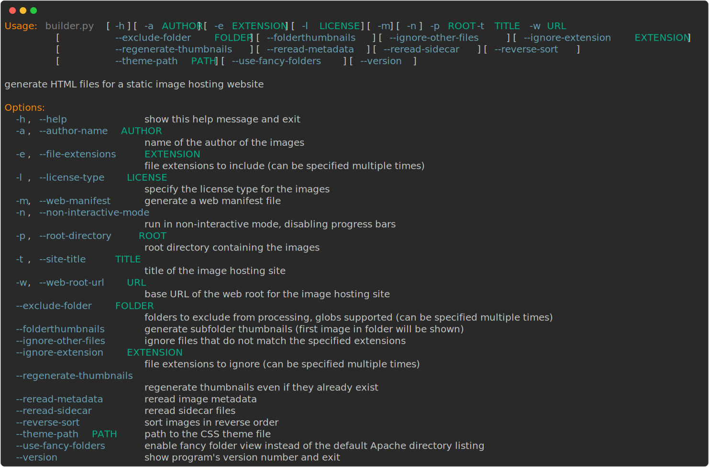

# StaticGalleryBuilder (SGB)

Python script to generate static HTML files for website galleries.

## Features

- **Generate HTML Files:** Creates HTML files for each folder in the specified root directory.
- **Thumbnail Creation:** Generates thumbnail previews for supported image formats.
- **Folder Navigation:** HTML files include navigation links to subfolders.
- **Responsive Design:** Generated HTML uses responsive design.
- **License Information:** Optionally include imgae license (CC licenses).
- **CSS Theme Support:** CSS themes included.
- **Folder Exclusion:** Exclude folders from processing.
- **Selective File Extensions:** Specify file extensions to include in the gallery (jpg, png).
- **Ignore Other Files:** Ignore files other than those specified by the included extensions.
- **Info Tooltips:** Display additional information as tooltips for images if an `info` file is present in the directory.
- **Generate Web Manifest:** Generates a web manifest file for PWA (Progressive Web App) support.
- **Generate on the fly icons:** If `cairosvg` is installed the script will generate icons from the css theme colors automatically.

## Requirements

- Python 3.x
- `tqdm` library
- `Jinja2` library
- `Pillow` library
- `rich_argparse` library
- `cairosvg` library (for SVG to PNG icon conversion)
- `python-json-logger` library (for logging)

## Installation

Install the required libraries using pip:

```sh
pip install tqdm Jinja2 Pillow rich-argparse cairosvg python-json-logger
```

## Usage

The script supports several command-line options to customize its behavior. Below is the list of available options:



### Options

- `-a AUTHOR, --author-name AUTHOR`: Specify the name of the author of the images. Default is "Author".
- `-e EXTENSION, --file-extensions EXTENSION`: Specify the file extensions to include. This option can be specified multiple times.
- `-l LICENSE, --license-type LICENSE`: Specify the license type for the images. Choices are `cc-zero`, `cc-by`, `cc-by-sa`, `cc-by-nd`, `cc-by-nc`, `cc-by-nc-sa`, and `cc-by-nc-nd`.
- `-m, --web-manifest`: Generate a web manifest file.
- `-n, --non-interactive-mode`: Run in non-interactive mode, disabling progress bars.
- `-p ROOT, --root-directory ROOT`: Specify the root folder where the images are stored. **(This option is required)**.
- `-t TITLE, --site-title TITLE`: Specify the title of the image hosting site. **(This option is required)**.
- `-w URL, --web-root-url URL`: Specify the base URL for the web root of the image hosting site. **(This option is required)**.
- `--exclude-folder FOLDER`: Specify folders to exclude from processing. This option can be specified multiple times.
- `--ignore-other-files`: Ignore files that do not match the specified extensions.
- `--regenerate-thumbnails`: Regenerate thumbnails even if they already exist.
- `--reread-metadata`: Reread image metadata if it already exists.
- `--reverse-sort`: Sort images by reverse name order.
- `--theme-path PATH`: Specify the path to the CSS theme file. Default is the provided default theme.
- `--use-fancy-folders`: Enable fancy folder view instead of the default Apache directory listing.

### Examples

To generate HTML files and thumbnails for a directory `/data/pictures` and host them on `https://pictures.example.com`, run:

```sh
./builder.py -p /data/pictures -w https://pictures.example.com -t "My Photo Gallery"
```

To include a license and author:

```sh
./builder.py -p /data/pictures -w https://pictures.example.com -t "My Photo Gallery" -l cc-by -a "John Doe"
```

To specify a custom CSS theme:

```sh
./builder.py -p /data/pictures -w https://pictures.example.com -t "My Photo Gallery" --theme-path custom_theme.css
```

To exclude specific folders and specify file extensions:

```sh
./builder.py -p /data/pictures -w https://pictures.example.com -t "My Photo Gallery" --exclude-folder Archives --exclude-folder Temp -e .jpg -e .jpeg -e .png
```

To generate a web manifest file:

```sh
./builder.py -p /data/pictures -w https://pictures.example.com -t "My Photo Gallery" -m
```

## Notes

- The root and web root paths must point to the same folder, one on the filesystem and one on the web server. Use absolute paths.
- The script generates the preview thumbnails in a `.thumbnails` subdirectory within the root folder.
- The `.lock` file prevents multiple instances of the script from running simultaneously. Make sure to remove it if the script terminates unexpectedly.

## License

This project is licensed under the AGPL-3.0 License. See the [LICENSE](LICENSE) file for details.
