# Custom CSS Themes

You can create custom Themes. They must at least include the following:

## Requirements for Themes

### Required Variables

Define the following variables in your theme:

- `--color1`: Primary color
- `--color2`: Secondary color
- `--color3`: Additional color
- `--color4`: Another color

These variables are essential for automatic icon generation.

### Folder Icon Specification

Include the following CSS rule to specify the folder icon used in your theme:

```css
.folders img {
  content: url("data:image/svg+xml,%3Csvg width='800px' height='800px' viewBox='0 0 1024 1024' class='icon' version='1.1' xmlns='http://www.w3.org/2000/svg' fill='%23000000'%3E%3Cg id='SVGRepo_bgCarrier' stroke-width='0' /%3E%3Cg id='SVGRepo_tracerCarrier' stroke-linecap='round' stroke-linejoin='round' /%3E%3Cg id='SVGRepo_iconCarrier'%3E%3Cpath d='M853.333333 256H469.333333l-85.333333-85.333333H170.666667c-46.933333 0-85.333333 38.4-85.333334 85.333333v170.666667h853.333334v-85.333334c0-46.933333-38.4-85.333333-85.333334-85.333333z' fill='%233674e7' /%3E%3Cpath d='M853.333333 256H170.666667c-46.933333 0-85.333333 38.4-85.333334 85.333333v426.666667c0 46.933333 38.4 85.333333 85.333334 85.333333h682.666666c46.933333 0 85.333333-38.4 85.333334-85.333333V341.333333c0-46.933333-38.4-85.333333-85.333334-85.333333z' fill='%236495ed' /%3E%3C/g%3E%3C/svg%3E");
  fill: var(--color1); /* Adjust fill color as per your theme */
}
```

Replace the SVG data URI (`url("data:image/svg+xml,...")`) with your desired SVG icon content. Adjust the `fill` color to match `--color1` or another suitable color from your theme's palette.

## Previews of included themes

### Alpenglow Theme

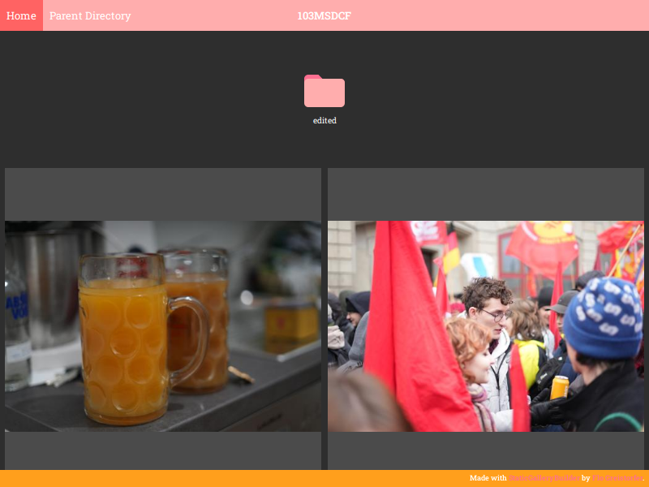

### Aritim Dark Theme

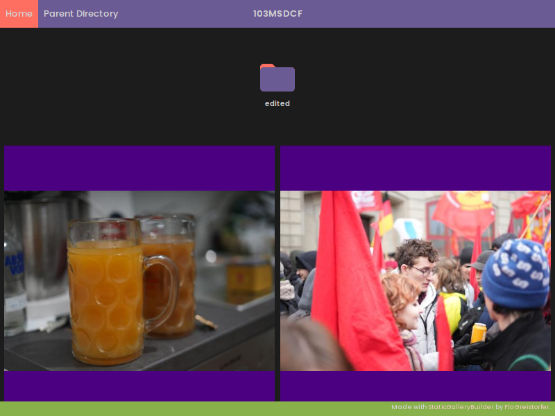

### Aritim Theme

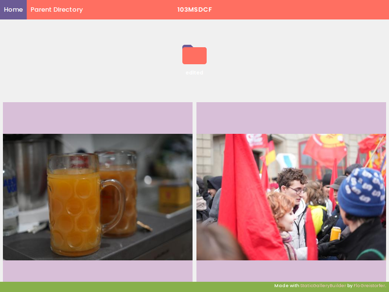

### Autumn Theme

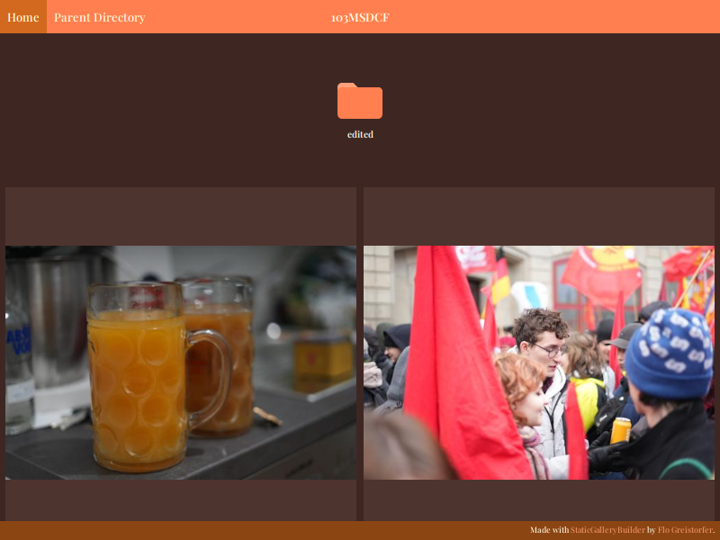

### Carnation Theme

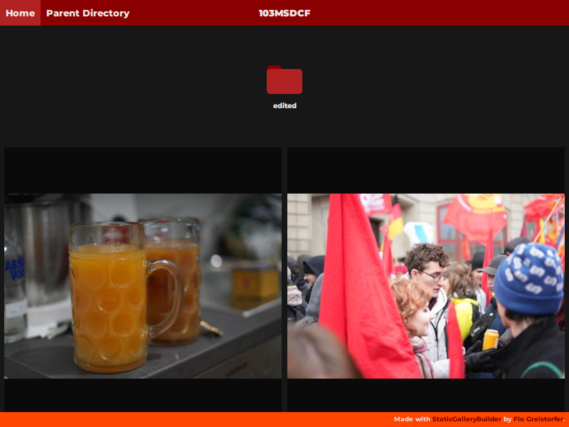

### Catpuccino Theme

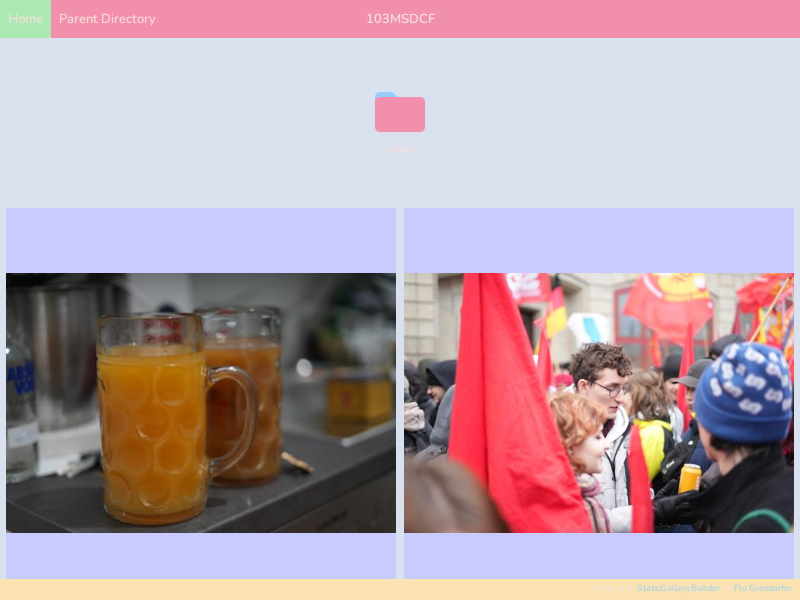

### Cornflower Theme

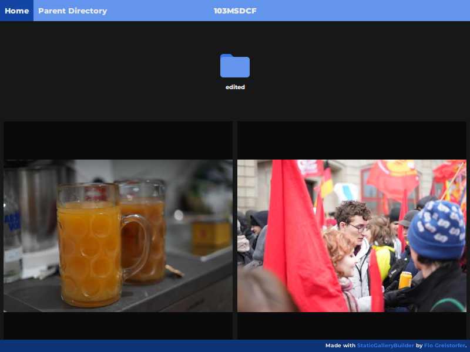

### Default Dark Theme

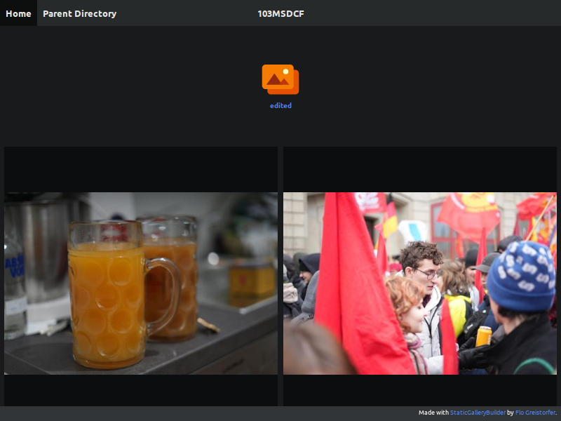

### Default Theme

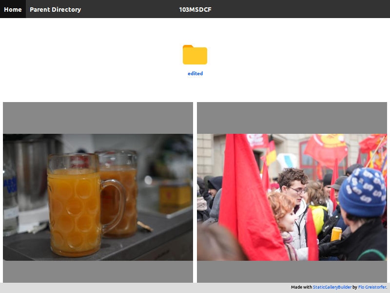

### Ivy Theme

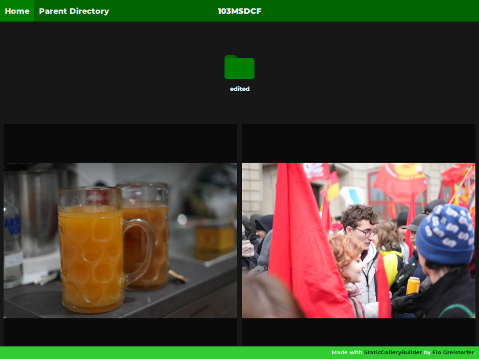

### Kjoe Theme

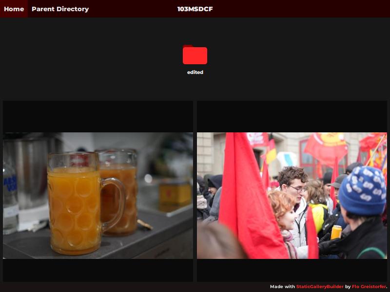

### Monokai Vibrant Theme

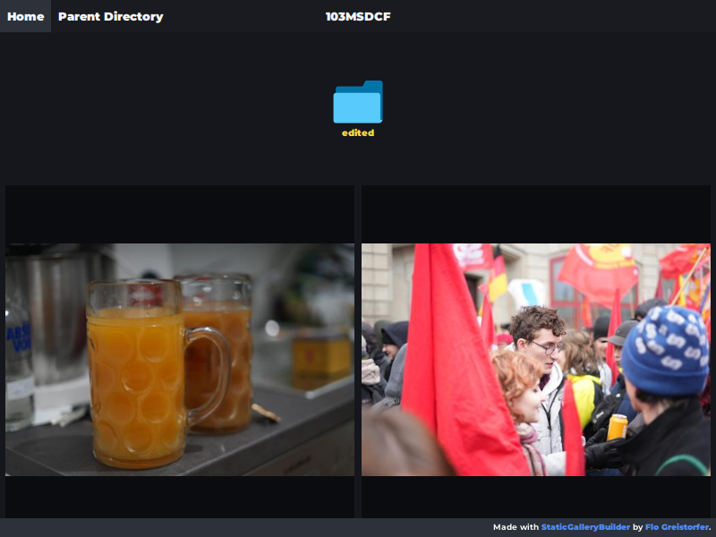

### Rainbow Theme

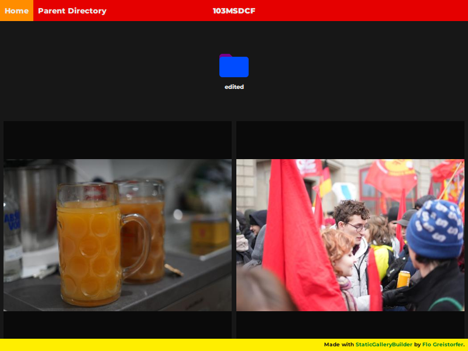

### Spring Theme

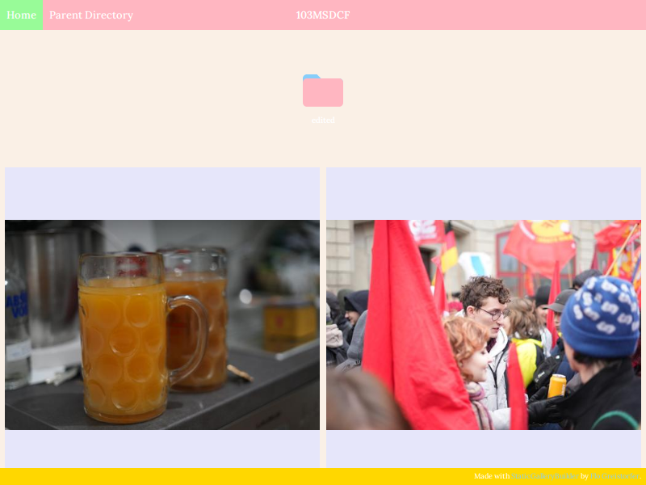

### Steam Theme

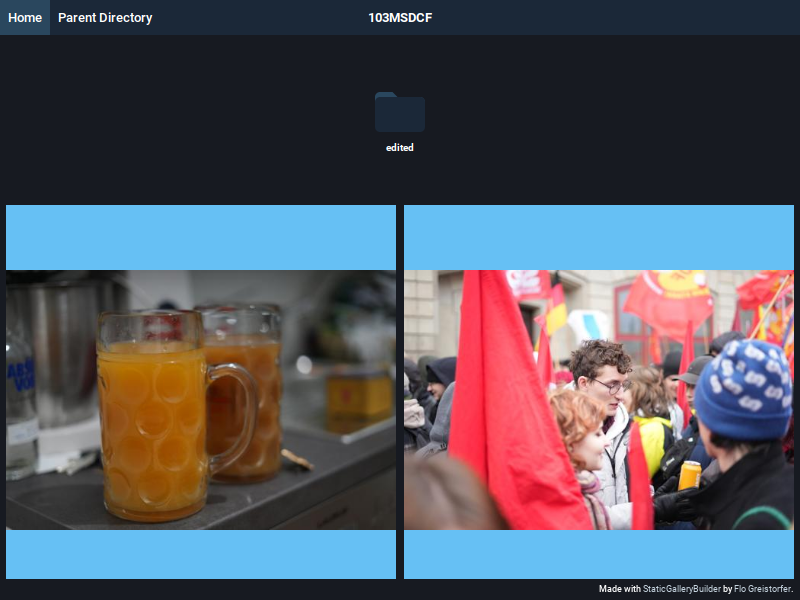

### Summer Theme

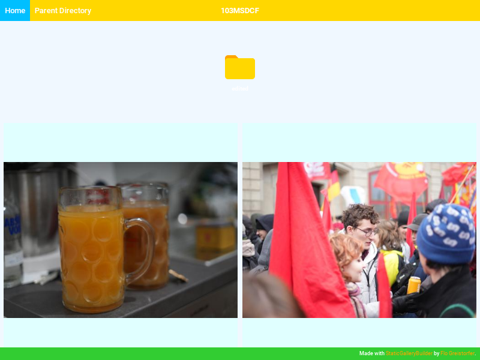

### Sunflower Theme

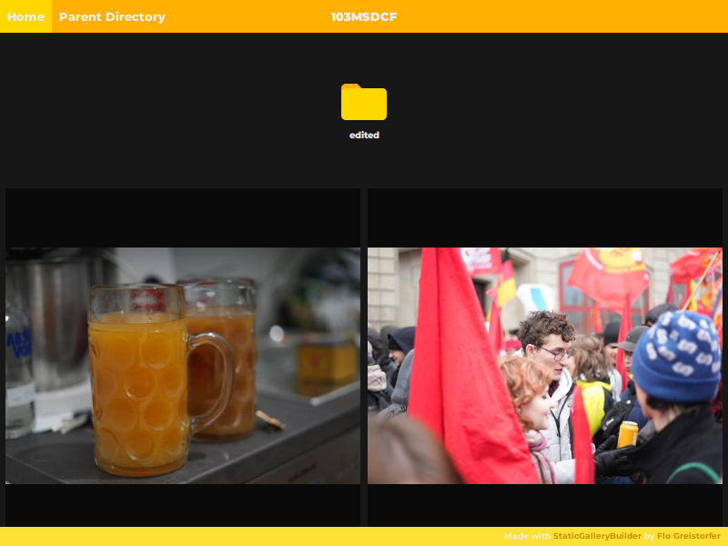

### Winter Theme

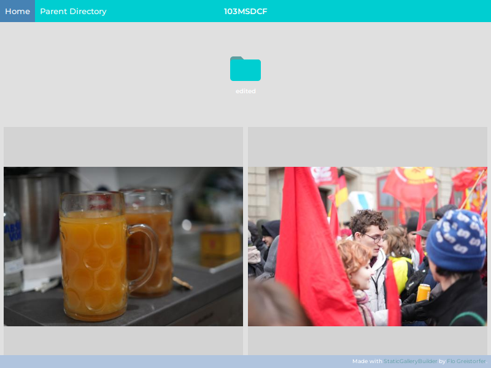
